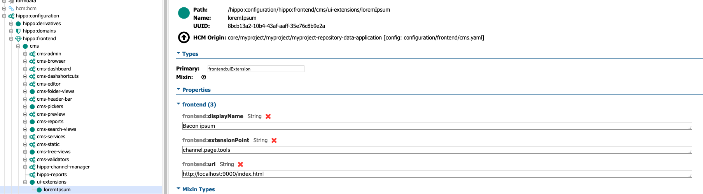

# Bloomreach OSM Location picker
This project is a Bloomreach [OpenUI extension](https://documentation.bloomreach.com/library/concepts/open-ui/introduction.html). 
The purpose of the extension is to allow editors to generate lorem ipsum quickly using the [Bacon Ipsum API](https://baconipsum.com/json-api/)

## How to setup the extension in your project?

1. You will have to load the extension, either on its own server (npm/apache) or somehow inside Bloomreach (cms/site).
2. You'll have to define the extension under `/hippo:configuration/hippo:frontend/cms/ui-extensions`. Sample configuration below:

