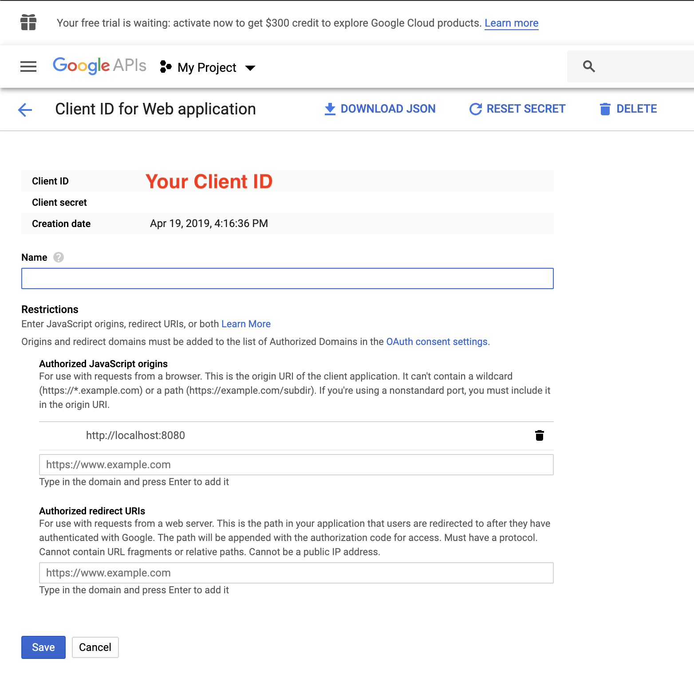
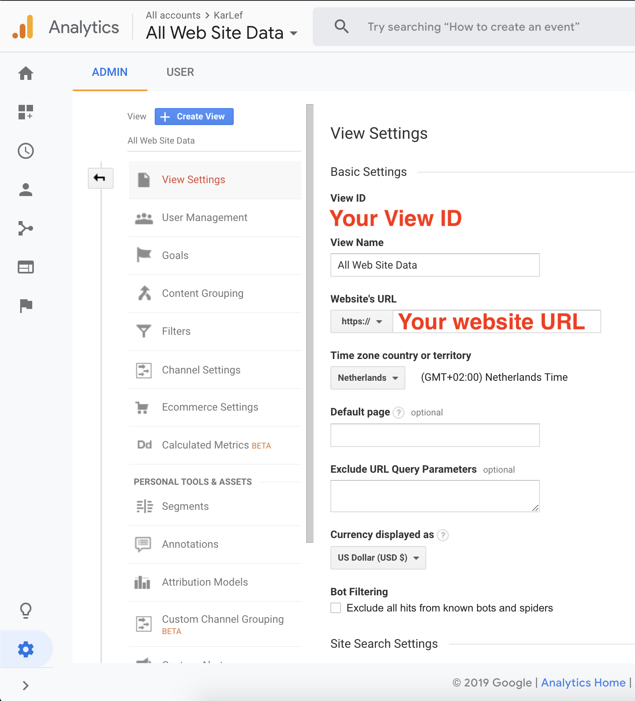

# BloomReach Google Analytics UI Extension

This UI Extension is a very simple example of how BloomReach Experience can be configured and integrated with Google Analytics.

The Google Analytics UI Extension in action


## How does the UI Extension work?

The extensions is a quickstart using the reporting API [3]. It executes a simple query to fetch a few basic metrics (eg page views, total visitors, new visitors etc). Other features showcased are the sing in/sing out, user information and full response.
Another purpose of the quickstart is to make sure that everything minimal required is in place and configured properly by seeing correct data coming in.   
Google analytics offers various APIs that you can leverage depending on your requirements (eg. reporting, collection, configuration). For all the available options and more technical details please consolidate the according page [2]. 

## Requirements
- A BloomReach Experience Manager (brXM) project running on version 13.0.0 or above.
- A Google Analytics account configured for tracking on your site.
- Important Note : if the google sign in in the extension works in incognito mode but doesn't work in normal first check your browser extensions. It is possible that one of them is blocking the login. A known extension causing this is Ghostery. You can disable or pause if possible the plugins one by one to validate which one is causing the issue.   

## Use the Google Analytics UI Extension in your brXM project

### Step 1: Enable Google Analytics API for your project
From [Hello Analytics Reporting API v4. JavaScript quickstart](https://developers.google.com/analytics/devguides/reporting/core/v4/quickstart/web-js) follow the instructions of the 1st step.
Your configuration panel should look like the example image below



Copy your ClientID as it will be required in a later step for configuring the UI extension. 

### Step 2: Acquire your Google Analytics View ID 
You can find your Google Analytics View ID from your Google Analytics Account by navigating to the Admin panel and then selecting View Settings from the View column. See example below



Copy your View ID as it will be required in a later step for configuring the UI extension. 

### Step 3: Configure the extension in brXM
Open the console of your brXM instance and browse to the node `/hippo:configuration/hippo:frontend/cms/ui-extensions`. Then import the following YAML snippet:

```
ga:
  jcr:primaryType: frontend:uiExtension
  frontend:displayName: Google Analytics
  frontend:extensionPoint: channel.page.tools
  frontend:url: https://bloomreach.github.io/ui-extensions/samples/ga/
  frontend:config: '{"VIEW_ID":"your-view-id", "CLIENT_ID":"your-client-id"}'
```

The config property holds a JSON object with your account specific IDs. These two values are required in order to be able to access the Google Analytics API for your project.

### Step 4: Write your own code to meet your requirements
The purpose of this extension is to showcase the possibility of integrating with Google Analytics with a couple easy examples.
Now you can write your own extension according to your needs and configure by simply replacing the value of the property frontend:url under /hippo:configuration/hippo:frontend/cms/ui-extensions/ga

## Resources
- [1] [BloomReach UI Extensions Documentation](https://documentation.bloomreach.com/library/concepts/open-ui/introduction.html) <br>
- [2] [Google Analytics Integration](https://developers.google.com/analytics/devguides/integrate/)
- [3] [Reporting API v4](https://developers.google.com/analytics/devguides/reporting/core/v4/)


