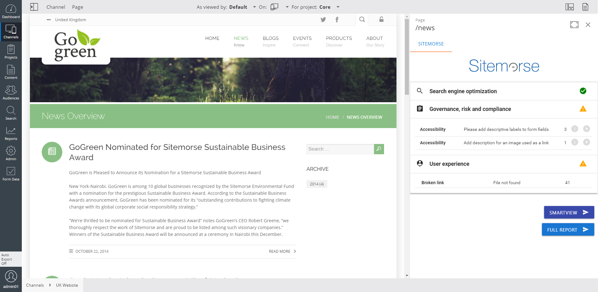

# Sitemorse UI Extension for Bloomreach Experience

This UI Extension integrates Bloomreach Experience with Sitemorse. It leverages Sitemorse's CMS Integration library (inCMS) to bring automated page and site auditing to BloomReach powered sites.

The Sitemorse UI Extension in action

## How does the UI Extension work?

From the Bloomreach Channel Manager menu, the sitemorse page tool can be opened. In the tools side panel, the extension then analyzes the current page for issues on topics such as SEO and Compliance. The results are then displayed in the Sitemorse extension and from there the user can navigate to the Sitemorse dashboard for more detailed reports.

## Requirements
- A BloomReach Experience Manager (brXM) project running on version 13.3.0 or above.
- An account id from Sitemorse.
- Access to a REST endpoint that runs the Sitemorse SCI client.

## How to use the Sitemorse Extension

For details about how to configure the Sitemorse extension, please get in touch with us through your account manager, support contact, or our (contact form)[https://www.bloomreach.com/en/about/contact-us].

## Resources
- [Sitemorse](https://sitemorse.com/)
- [BloomReach UI Extensions Documentation](https://documentation.bloomreach.com/library/concepts/open-ui/introduction.html)
